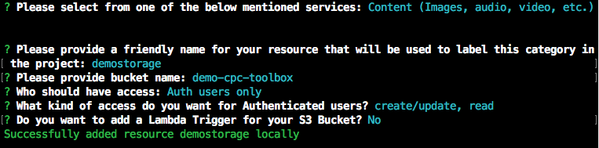

# Portfolio Toolbox (Examiner Portfolio)
A supplemental toolbox that automates tasks to help reduce the time spent to evaluate an Examiner's portfolio during our transition period. 

The idea stemmed from a personal problem, and what appeared to be a need by other Examiners during training of tools that were already provided.

As an Examiner myself, I could see the impact first hand and how basic functionality was missing and under the time constraint automation could help simplify tasks.

### In Agile terms: 
**Epic**  
As an Examiner, I want a cohesive area with relevant data to efficiently evaluate my portfolio for the addition, removal, or keeping of CPC symbols.

**Story**  
As an Examiner, I want to see the titles of the CPC symbols to decide if a CPC symbol should be added, removed, or kept in my portfolio.

------- 

This project is a functional prototype as a proof of concept, which can then be improved upon with feedback from other Examiners.

### Tech. Stack
**Frontend** 
- JavaScript + HTML / CSS 
- Amplify SDK (Cognito, OAuth, S3)
- React + React router (Frontend)
  - Parcel (Bundler)
- Netlify (Hosting)

**Backend**
- Python (Logic)
- AWS
  - Lambda (Compute)
  - S3 (Storage)
  - Boto3 SDK
  - API Gateway (Routing) 
  - X-Ray (Monitoring)
  - Cloud Watch (Logging) 
- Openpyxl (Excel Library)

### Lessons Learned
- Taking a business need and translating that into a software solution 
- Having the support and backing is important to have solutions to progress forward.
- External API limits are present and should be thought about prior to implementation

### Remove for Improvements
- Caching to help with both performance and API limits
- Break code structure down to smaller modules
- Feedback by examiners to add additional tools

-----

### Initial setup and run in your own environment
1. Setup Amplify
2. Setup Lambda function with processor.zip file
3. Setup API Gateway and connect to Lambda

ENV variables
- BASE_URL from Lambda function (App.js)
- BUCKET - created from Amplify ()
- PRE - generic (pre-processed)
- POST - generic (post-processed)

**Note:** The below steps assume the project will be run locally.

Required 
- AWS account (Lambda, Cognito, S3)
### AWS IAM permissions
  - create a user in IAM with the proper permission to allow amplify use
    - keep the ID and secret in a safe place for use with AWS and Amplify CLI
  - create a role for a Lambda that has (AWS managed) and save the ARN for the created role
    - S3 Full Access
    - X-Ray Full Access
    - Lambda Basic Execution
### Google OAuth Client
- Google Account (OAuth 2.0 client)
  Create an [OAuth 2.0 Client](https://developers.google.com/identity/protocols/oauth2/javascript-implicit-flow) in your google account
  - client ID
  - client secret

### Install the AWS and Amplify CLIs
- AWS CLI [install docs](https://docs.aws.amazon.com/cli/latest/userguide/install-cliv2.html) 
  - [ref API](https://docs.aws.amazon.com/cli/latest/reference/index.html#cli-aws)
- Amplify CLI [setup tutorial](https://docs.amplify.aws/start/getting-started/installation/q/integration/react#option-2-follow-the-instructions)
  - set a profile using `aws configure` with the IAM user you previously created

Setup Frontend
### After setup of IAM and CLIs
Install the project repo and go to the frontend dir
`git clone https://github.com/developerfitz/cpc-portfolio.git`
`cd cpc-portfolio/frontend-react-amplify`

Using Amplify CLI initialize the amplify project and follow the steps below
`amplify init` (is there a way to pre populate this?) and follow the prompt 
Here is a screenshot of my config. 

Add authentication 
`amplify add auth` 
 
If using Google as a Federated after creating a project and OAuth Client you should be to get the Client ID and Secret from the page as shown below:

TODO: change the screenshot to use localhost:3005/examiner for the signin redirect

`amplify add storage`  

 

`amplify push`

After pushing you will git a Hosted UI Endpoint along with a Test endpoint similar to below. Suggest using the test endpoint to verify.
- `https://<domain-name-stage>.auth.us-east-1.amazoncognito.com/`
- `https://<domain-name-stage>.auth.us-east-1.amazoncognito.com/login?response_type=code&client_id=<client-id>&redirect_uri=http://localhost:3005/`

You should now have the following files and dir
- `aws-export.js` in frontend-react-amplify/src/
- `amplify` and `amplify.json` in frontend-react-amplify/
**Note:** the `aws-export.js` file has the names and config of Cognito and S3 such as the `domain` for origins and `user pools id` 
Put the created Host URI in Google account only up to.

Going back to the Google OAuth Client add the URIs:
**Authorized origins**
`https://<domain-name-stage>.auth.us-east-1.amazoncognito.com`

**Authorized redirects**
`https://<domain-name-stage>.auth.us-east-1.amazoncognito.com/oauth2/idpresponse`
`http://localhost:3005/examiner`

Using the AWS CLI configure the attributes mapping for Google OAuth Client 
`aws cognito-idp update-identity-provider --user-pool-id <user-pool-id> --provider-name Google --attribute-mapping name=name,username=sub,email=email`
**Note:** user-pool-id can be found in the aws-export.js file 

`yarn` or `yarn install`

`yarn start`

Open a browser and go to `http://localhost:3005`
- should be able to login with Google or sign up for a new account

### Setting up the Backend
Setup Lambda function
- set ENV variables
  - BUCKET get from aws-export.js
  - PRE = pre-processed (generic)
  - POST = post-processed (generic)

`cd ../backend-lambda-functions/excel-processor`

Upload the `processor.zip` file using the below AWS CLI command
`
  aws lambda create-function \
  --function-name demo-processor \
  --runtime python3.7 \
  --zip-file fileb://processor.zip \
  --role arn:aws:iam::<AWS#>:role/demo-lambda-role \ 
  --handler app_function.excel_processor
`
Once completed, a screen will pop up with the function information

Configure the function with the following configuration 
- `BUCKET` - can be found in the `aws-export.js` file `aws_user_files_s3_bucket`
- `PRE` - pre-processed (generic)
- `POST` - post-processed (generic)
  
`
aws lambda update-function-configuration \
--function-name demo-processor \
--timeout 180 \
--environment Variables="{BUCKET=demo-cpc-toolbox-dev,PRE=pre-processed,POST=post-processed}" \
--tracing-config Mode=Active
`

create and set up API Gateway and link to created Lambda
- using the AWS console setup an API gateway [Create API tutorial](https://docs.aws.amazon.com/apigateway/latest/developerguide/api-gateway-create-api-as-simple-proxy-for-lambda.html#api-gateway-create-api-as-simple-proxy-for-lambda-build)
- create API `<api-name>`
- create a resource demo-processor `/demo-processor`
  - check the "Enable API Gateway CORS" box
- create a `PUT` method on the `/demo-processor` resource
  - check the "Use Lambda Proxy integration" box
  - integrate with the created lambda, in this case `demo-processor`
- deploy the API and name the stage `dev`
  
- enable CORS `*` for `Access-Control-Allow-Headers` and `Access-Control-Allow-Origin` 
  
- go to stages and the `dev` stage and then `/demo-processor` and Copy the URL
  - `https://<random-name>.execute-api.us-east-1.amazonaws.com/dev/demo-processor`
  
Back in the terminal 
`cd ../../frontend-react-amplify/src/`
Open `App.js` and set the BASE_URL
  - set the URL in the `App.js`
  - `BASE_URL` = https://<random-name>.execute-api.us-east-1.amazonaws.com/dev
  - `PROCESS_PORTFOLIO` = `${BASE_URL}/demo-processor`

Test out the full app by uploading the sample excel (CPCTestSample.xlsx) in the demos dir
`yarn start`

TODO: having issues with downloading
- access denied even though logged in.

### Clean up
`cd frontend-react-amplify`
`amplify delete`
<y>

`cd ../backend-lambda-function`
`aws lambda delete-function --function-name demo-processor`
`aws apigateway get-rest-apis`
copy the id of the api you want to delete
`aws apigateway delete-rest-api --rest-api-id <api-id>`