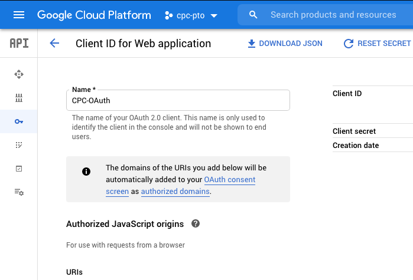

# Portfolio Toolbox (Examiner Portfolio)
A supplemental toolbox that automates tasks to help reduce the time spent to evaluate an Examiner's portfolio during our transition period. 

The idea stemmed from a personal problem, and what appeared to be a need by other Examiners during training of tools that were already provided.

As an Examiner myself, I could see the impact first hand and how basic functionality was missing and under the time constraint automation could help simplify tasks.

### In Agile terms: 
**Epic**  
As an Examiner, I want a cohesive area with relevant data to efficiently evaluate my portfolio for the addition, removal, or keeping of CPC symbols.

**Story**  
As an Examiner, I want to see the titles of the CPC symbols to decide if a CPC symbol should be added, removed, or kept in my portfolio.

------- 
### Demo
This project is a functional prototype as a proof of concept, which can then be improved upon with feedback from other Examiners.


### Tech. Stack
**Frontend** 
- JavaScript + HTML / CSS 
- Amplify SDK (Cognito, OAuth, S3)
- React + React router (Frontend)
- Parcel (Bundler)
- Netlify (Hosting)

**Backend**
- Python (Logic)
- AWS
  - Lambda (Compute)
  - S3 (Storage)
  - Boto3 SDK
  - API Gateway (Routing) 
  - X-Ray (Monitoring)
  - Cloud Watch (Logging) 
- Openpyxl (Excel Library)


### Lessons Learned
- Taking a business need and translating that into a software solution 
- Having the support and backing is important to have solutions to progress forward.
- External API limits are present and should be thought about prior to implementation


### Remove for Improvements
- Caching to help with both performance and API limits
- Break code structure down to smaller modules
- Feedback by examiners to add additional tools

-----

### Initial setup to run the project in your own environment
#### Fill free to look over the code or try to run the app
Code that contains `< >` are to be replaced with the specified or generic name.  
**Note:** The below steps assume the project will be run locally.

**Required:** 
- AWS account (Lambda, Cognito, S3)
- AWS and Amplify CLIs

If you would like to use Google as a Social Provider you'll also need: 
- Google Account (OAuth 2.0 client)

### AWS IAM permissions
1. [Create a user in IAM](https://docs.aws.amazon.com/IAM/latest/UserGuide/id_users_create.html) with the proper permission to allow amplify usage.
     - Save the **Access Key ID** and **Secret Access Key** in a safe place for use with AWS and Amplify CLIs.
2. [Create a Lambda role](https://docs.aws.amazon.com/IAM/latest/UserGuide/id_roles_create_for-service.html#roles-creatingrole-service-console) that has the following AWS managed policies.
     - S3 Full Access
     - X-Ray Full Access
     - Lambda Basic Execution
3. Save the ARN for the created Lambda role.


### Google OAuth Client
[Create an OAuth 2.0 Client](https://developers.google.com/identity/protocols/oauth2/javascript-implicit-flow) in your google account and make note of the below items to be used if using Google as a Federated Provider.
  - Client ID
  - Client secret

### Install the AWS and Amplify CLIs
1. [Install AWS CLI](https://docs.aws.amazon.com/cli/latest/userguide/install-cliv2.html) ([API Reference for AWS CLI](https://docs.aws.amazon.com/cli/latest/reference/index.html#cli-aws)).
2. Set a profile for the AWS CLI using use the AWS **Access Key ID** and the **Secret Access Key**.
```
aws configure --profile <profile-name>
```  
- Input: `AWS Access Key ID`
- Input: `AWS Secret Access Key`
- Input: `AWS Region`

3. To view the newly created profile run:  
```
aws configure list-profiles
```

4. Set the profile as an environment variable to avoid specifying the profile for each command input.  

```
export AWS_PROFILE=<profile-name>
```

5. [Install Amplify CLI](https://docs.amplify.aws/start/getting-started/installation/q/integration/react#option-2-follow-the-instructions).

## Frontend
Install the project repo and change into the frontend directory (dir).  

```
git clone https://github.com/developerfitz/cpc-portfolio.git \
&& cd cpc-portfolio/frontend-react-amplify
```   


Using Amplify CLI initialize the amplify project and follow the prompts.  
```
amplify init
```


Add authentication for users.  
```
amplify add auth
```  
  

If using Google as a Social Provider after creating a project and OAuth Client in your Google account go to the Credentials tab to get the Client ID and Secret from the page as shown below.  



Add storage for files.  
```
amplify add storage
```  
  

Push additions to AWS cloud.  
```
amplify push
```  
  

After pushing you will git a Hosted UI Endpoint along with a test endpoint similar to below.
- `https://<domain-name-stage>.auth.us-east-1.amazoncognito.com/`
- `https://<domain-name-stage>.auth.us-east-1.amazoncognito.com/login?response_type=code&client_id=<client-id>&redirect_uri=http://localhost:3005/`

You should also have the following files and dir.
- `aws-export.js` in **frontend-react-amplify/src/**  
- `amplify` and `amplify.json` in **frontend-react-amplify/**  


**Note:** The `aws-export.js` file has the names and config of Cognito and S3 such as the **domain** for URI origin, **user pools id**, and **BUCKET**.


If using Google as a Social Provider, you need to set the URIs on the same page that has the OAuth Client ID:  
**Authorized origins**  
  - `https://<domain-name-stage>.auth.us-east-1.amazoncognito.com`

**Authorized redirects**  
  - `https://<domain-name-stage>.auth.us-east-1.amazoncognito.com/oauth2/idpresponse`  
  - `http://localhost:3005/examiner`

Using the AWS CLI configure the attributes mapping for Google OAuth Client. 
```
aws cognito-idp update-identity-provider 
  --user-pool-id <user-pool-id> 
  --provider-name Google 
  --attribute-mapping name=name,username=sub,email=email
```
**Note:** **user-pool-id** can be found in the `aws-export.js` file. 

Install app dependencies.  
`yarn` or `yarn install`  

Run the app locally.  
```
yarn start
```  

Open a browser and go to `http://localhost:3005`.  
- Sign-up or login with Google to create a user in Cognito
- `Ctrl + c` to stop the frontend server

## Backend
Change into the Lambda function dir.
```
cd ../backend-lambda-functions/excel-processor
```


Upload the `processor.zip` file using the below AWS CLI command. 
- `--function-name` can be anything (e.g., `demo-processor`)
```
aws lambda create-function \
  --function-name demo-processor \
  --runtime python3.7 \
  --zip-file fileb://processor.zip \
  --role arn:aws:iam::<AWS#>:role/demo-lambda-role \ 
  --handler app_function.excel_processor
```  

Once completed, a screen will appear with the function information.

Configure the Lambda function.   
- `BUCKET` - can be found in the `aws-export.js` file `aws_user_files_s3_bucket`
- `PRE` - pre-processed (generic)
- `POST` - post-processed (generic)
  
```
aws lambda update-function-configuration \
  --function-name demo-processor \
  --timeout 180 \
  --environment \
  Variables="{BUCKET=demo-cpc-toolbox131139-dev,\
  PRE=pre-processed,POST=post-processed}" \
  --tracing-config Mode=Active
```


#### Create an API Gateway and integrate with Lambda
1. Using the AWS console setup an API gateway [Create API tutorial](https://docs.aws.amazon.com/apigateway/latest/developerguide/api-gateway-create-api-as-simple-proxy-for-lambda.html#api-gateway-create-api-as-simple-proxy-for-lambda-build).
2. Create a REST API and name it (e.g., `demo-api`).
3. Create a resource endpoint (e.g., `/demo-processor`).
4. Create a `PUT` method on the resource endpoint (e.g., `/demo-processor` resource.
     - check the "Use Lambda Proxy integration" box
     - integrate with the created lambda, in this case `demo-processor`
5. `Enable CORS` and set `'*'` for `Access-Control-Allow-Headers` and `Access-Control-Allow-Origin`.  
7. Deploy the API and name the stage `dev`.
8. Copy the URL from in the stages section.  
  

  
Moving back to the terminal. 
```
cd ../../frontend-react-amplify/src/
```

Open `App.js` in the `src` dir and set the `BASE_URL` (copied API Gateway URL) and `PROCESS_PORTFOLIO` (created resource) variables.
  - `BASE_URL` = `https://<random-name>.execute-api.us-east-1.amazonaws.com/dev`
  - `PROCESS_PORTFOLIO` = `${BASE_URL}/demo-processor`


Everything has been setup and you should have a fully functioning app.  
```
yarn start
```  

Test out the app by uploading the sample excel file `CPCTestSample.xlsx` in the `demo` dir.
1. Open a browser and go to `http://localhost:3005/`
2. Login with Google or Sign Up with email and password
3. After logging in upload `CPCTestSample.xlsx` file
4. Download the processed (e.g., `processed-CPCTestSample.xlsx`) excel file


### Clean up
`Ctrl + c` to stop the server running the app.
Delete the resources created with amplify by going to the `frontend-react-amplify` dir. 
```
cd .. # assuming you are in the src dir
```   
```
amplify delete
```   


Delete the backend Lambda Function and API Gateway.  
```
aws lambda delete-function --function-name demo-processor
```

Copy the id of the api you want to delete and delete the api.  
```
aws apigateway get-rest-apis
```  
  
```
aws apigateway delete-rest-api --rest-api-id <api-id>
```